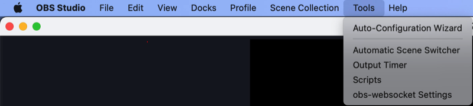
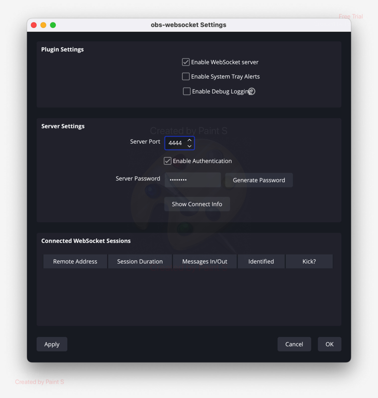

## OBS_Websocks
 OBS websocks plugin for Rotorhazard to allow control recording at start and stop of the race.

## Features
* Start/Stop OBS recording at every race. 
* Star recording before race starts (parameter in milliseconds)
* Restart connection to OBS in case of a failed call to the Webservice
* A start/stop recording failure raises a high-priority message in the front end.
 

## Install

 pip install -r .\requirements.txt

Add the parameter "BS_WS" to the bottom of the config.json file. You can source the template at config-dist.json in this directory.

```
{
"OBS_WS": {
	"ENABLED": true,
	"HOST": "127.0.0.1",
	"PORT": 4444,
	"PASSWORD": "YourPassword",
	"PRE_START": 2000
  }
}
```


Set your IP, port, and password.

This plug-in can be active/inactive by setting the parameter ENABLED accordingly.

The recording can be activated before the race starts by setting the parameter PRE_START with int value (milliseconds) to the start. Note, the waiting is done in intervals of 0,1 seconds.


### On the OBS app

Go to tools > obs-socket_sething



Then set the server port and the password. 


